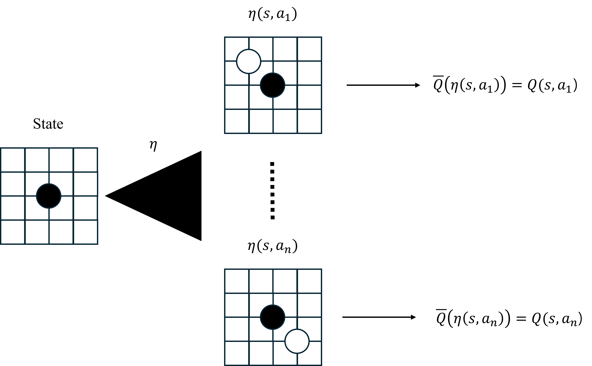
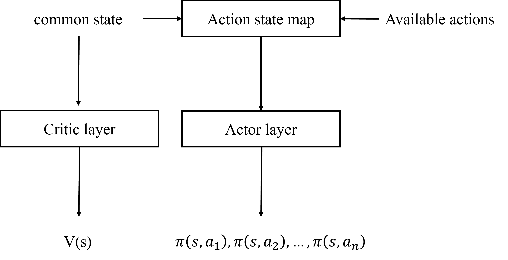
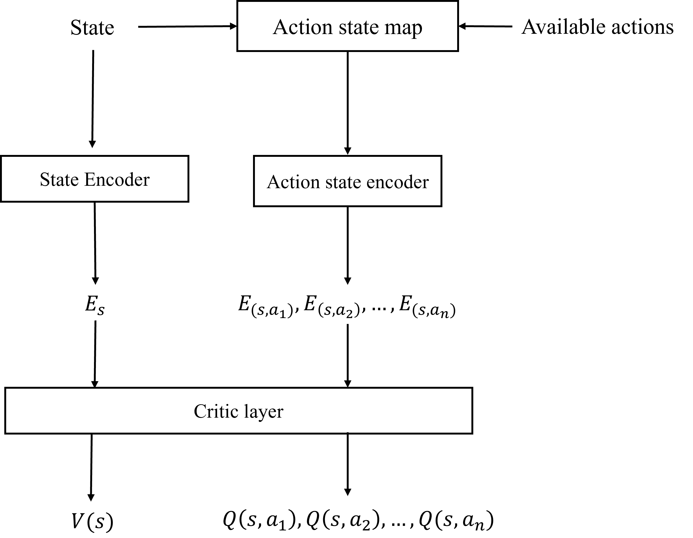

# 1.개요
어떤 환경은 수 많은 행동의 가짓수를 가지고있다. 예를 들어서, 19x19 격자의 바둑판에서 오목을 둔다고 생각해보자. 그러면, 처음 돌을 둘 수 있는 수는 19*19 =  361가지가 있고, 각 플레이어가 차례를 돌아가면서 점점 돌을 둘 수 있는 경우의 수가 줄어든다. 우리가 만약 오목을 두는 에이전트를 deep neural network를 통해서 만든다고 상상해보자. 그러면, 우리는 각 자리에 돌을 두었을때의 action value 또는 각 action에 따른 확률을 어떻게 구해주는 것이 가장 바람직할까?

단순한 방법으로는, 단순히 19*19개의 값을 출력해서 각 자리에 둘 확률과 두었을 때의 가치를 구하는 방법이 있을 것이다. 해당 방법은 단순하지만, 우리가 앞서 상상한 환경에서는 몇가지 문제점이 있다. 첫 번째로는, illegal action을 어떻게 처리하는지에 대한 문제이다. illegal action을 처리하는 방법에는 여러가지 방법이 있겠지만 보통은 해당 action에 peanalty를 부과하거나, 해당 action에 대해서는 masking 처리해서, action을 방지하는 방법이 있다. 두 번째로는, 항상 모든 action에 대한 결과에 대해서 결과값을 출력한다는 것이다. 그렇다면 이러한 방법을 어떻게 극복할 수 있을까? 이 글에서는 각 상태와 행동쌍에 대해서 일대일 대응을 만족하는 **action state**를 통해서, 각 **action state**에 대하여 가치를 구해서 해결할 것이다. 그러나, 해당 방법에도 몇가지 문제점이 존재하는데, 학습 방법과 효율성이 그 예다. 하지만, 이런 문제점은 정책 함수의 근사와 기존 정책의 결합을 통해서 해결할 수 있는데 **action state**에 대해서 정의하고, 해결 방법에 대해서 알아보도록한다.

# 2. action state
모든 state들의 집합을 $\mathcal{S}$, 모든 action들의 집합을 $\mathcal{A}$라고하자. 그러면, state-action쌍에 대하여 다음과 같은 함수를 정의할 수 있다.

$\eta: \mathcal{S}\times \mathcal{A} \rightarrow \overline{S}$ 이고, $\eta$는 bijective 그러면 우리는 이 함수를 **action state map**이라고 정의한다.

그러면 우리는 다음과 같은 action value function $Q$와, 정책함수 $\pi$를 통해서 다음과 같은 관계를 가진 함수 $\overline{Q}$, $\overline{\pi}$를 정의해줄 수 있다.

$Q(s_t, a_t) = \overline{Q} \circ \eta(s_t, a_t)$

$\pi(s_t, a_t) = \overline{\pi} \circ \eta(s_t, a_t)$

action-state map을 이용하면, 다음과 같은 장점이 존재한다.

**1.해당 환경에 대한 지식이 존재한다면, 해당 행동에대한 유용한 정보를 제공해줄 수 있다.** 

예를 들어서, 바둑은 결정적(deterministic environment)환경이므로, $\eta(s_t, a_t)$를 상태 $s_t$에서 행동 $a_t$를 취했을 때의 행동으로 정해준다면, $\overline{Q}(s_t, a_t) = V(s_{t+1})$이 된다. 결정적 환경이 아니여도, 해당 행동을 취했을 떄의 정보를 추가해줄 수 있다는 장점이 있다. 예를 들어서, 빅 투라는 카드 게임을 생각해보자. 해당 게임의 경우 자신의 손패에서 족보를 만족하는 패를 먼저 다 버리면 이기는 게임이다. 해당 게임에서는 결정적 환경이 아니므로 비록 다음 상태를 예측할 수 없지만, 카드를 버린 뒤 남은 손패의 정보를 추가해서 action-state를 구성해줄 수 있다. 그러한 정보를 통해서 만약 이 패를 버렸을 시 다음에 버릴 수 있는 패의 정보를 알 수 있기 때문에, 해당 정보를 추가해준다면 아무런 정보도 없는 것보다 많은 장점이 존재한다.

**2.다양한 action shape 및 illegal action에 대하여 다루기 쉬워진다.**

앞에서 설명했던, 빅 투 게임 환경을 생각해보자. 빅 투 게임에서는 수 많은 족보가 존재하기 때문에, 만약 모든 action에 대해서 action-value나 probabiliy를 예상하려면 action의 경우의 수와 illegal action의 문제점이 존재한다.

빅 투 에서는 기본적으로 몇 천가지의 족보의 경우의 수가 존재한다. 따라서, 매 경우마다 모든 족보에 대해서 logit과 action value를 계산하는 것은 매우 비효율적이다. 그러나, aciton-state map을 이용해서 에이전트가 취할 수 있는 action에 대해서만 logit과 action-value를 구해주면은, action shape가 어떻든, illegal action이 존재하든, 행동 가능한 action과 전체 action에 대해서 gap이 존재해도, 결국 가능한 행동 내에서만 action state를 구해주면 되기때문에, 쉽게 해결해줄 수 있다.

# 3. actor based $\epsilon$-greedy policy
action-state map을 통하여 action value와, policy를 구성해서 학습 시 한가지 문제가 존재한다. 만약 우리의 action value가 완벽하게 예측이 되거나, policy가 optimal policy이면, $\text{argmax}Q = \argmax{\pi}$가 항상 성립해야한다. 그러나, 학습 시 그렇지 않은 경우가 존재한다. 따라서, 이를 해결하고, action-value가 높다고 기대되는 행동에 대해서 좀 더 많이 탐험을하여, 정책 함수가 올바르게 학습될 수 있도록 다음과 같은 정책 $\pi_{\epsilon}$을 정의한다. (단, $0 < \epsilon < 1$)

$\pi_{\epsilon} = \epsilon\times\text{GreedyPolicy} + (1-\epsilon)\pi$

# 4. Appoximation of $\pi$
마지막으로 action-state map을 통해서 학습을 진행하려고 하면은, 우리는 $\pi(a_i, s_i)$를 구하기 위해서, 모든 actioned-state에서의 값을 다시 구해줘야한다. 그러나, 이는 취하지 않은 행동에 대해서도 값을 구하기 때문에, 학습의 속도에 많은 영향을 준다. 그러나, 만약 우리가 특정 행동을 강화했을 때, 다른 행동의 logit값이 크게 변하지 않는다면, 에피소드 진행 시 취한 ationed-state만을통해서 새로운 정책의 해당 actioned-state에서의 확률을 구할 수 있다. 만약 우리가 softmax함수를 통해서 logit을 통해서 확률을 구한다고하자. 상태가 $s$일 때, action $a$를 취했을 때의 logit을 $l(s, a)$로 표기하자. 그러면, $$\pi(s, a) = \frac{e^{l(s, a)}}{\sum_{i=1}^{n} e^{l(s, a_i)}}$$이다. 현재 우리가 직면한 문제점은 취하지 않은 action에 대해서도 logit을 구해야되기 때문에, 훈련 시 많은 리소스가 소모된다는 단점이 있다. 따라서, 우리는 추론 시 $\sum_{i=1}^{n} e^{l(s, a_i)} \ - e^{l(s,a)} = \rho(s, a)$값을 저장한다음에, 활용할 것이다.  그러면,  $\pi(s, a) = \frac{e^{l(s, a)}}{\rho(s, a) + e^{l(s, a)}}$이다. 이제, 두 파라미터 $\theta_1, \theta_2$에 대응하는 정책과, logit을 $\pi_{\theta_1}, \pi_{\theta_2}, l_{\theta_1}, l_{\theta_2}$라고하자. 마찬가지로, $\sum_{i=1}^{n} e^{l_{\theta_i}(s, a_i)} \ - e^{l_{\theta_i}(s,a)} = \rho_{\theta_i}(s, a) \quad (i = 1, 2)$라고하자. 그러면, $\theta_1$에 대한 $\theta_2$의 정책 $\pi_{\theta_1}^{\theta_2}$를 다음과 같이 정의하자. $$\pi_{\theta_1}^{\theta_2}(s, a) = \frac{e^{l_{\theta_2}(s, a)}}{\rho_{\theta_1}(s, a) + e^{l_{\theta2}(s, a)}}$$ 그러면, 다음이 성립한다.

**Theorem 4.1** 

$$|\pi_{\theta_2} / {\pi_{\theta_1} ^ {\theta_2}} - 1| \leq |\rho_{\theta_1}/\rho_{\theta_2} -1|$$

***Proof)*** Since
$\displaystyle{
  \frac{\pi_{\theta_2}}{\pi_{\theta_1}^{\theta_2}} = 
  \frac{e^{l_{\theta_2}}}{\rho_{\theta_2} + e^{l_{\theta_2}}} \cdot \frac{\rho_{\theta_1} + e^{l_{\theta_2}}}{e^{l_{\theta_2}}} =
  \frac{\rho_{\theta_1} + e^{l_{\theta_2}}}{\rho_{\theta_2} + e^{l_{\theta_2}}} =
  \frac{\rho_{\theta_1} - \rho_{\theta_2}}{p_{\theta_2} + e^{l_{\theta_2}}} + 1 
  }$ and $e^{l_{\theta_2}} > 0$,  
  $\displaystyle{
    -\frac{|\rho_{\theta_1} - \rho_{\theta_2}|}{p_{\theta_2}} = -\left\vert \frac{\rho_{\theta_1}}{\rho_{\theta_2}} - 1\right\vert
    \leq -\frac{|\rho_{\theta_1} - \rho_{\theta_2}|}{p_{\theta_2} + e^{l_{\theta_2}}}
    \leq\frac{\pi_{\theta_2}}{\pi_{\theta_1}^{\theta_2}} - 1 \leq
    \frac{|\rho_{\theta_1} - \rho_{\theta_2}|}{p_{\theta_2} + e^{l_{\theta_2}}} \leq
    \frac{|\rho_{\theta_1} - \rho_{\theta_2}|}{p_{\theta_2}} = \left\vert \frac{\rho_{\theta_1}}{\rho_{\theta_2}} - 1\right\vert
  }$  
  Therefore, $\displaystyle{|\pi_{\theta_2} / {\pi_{\theta_1} ^ {\theta_2}} - 1| \leq |\rho_{\theta_1}/\rho_{\theta_2} -1|}$

여기서 주목해야 할 점은 $\rho$은 우리가 택한 행동의 logit값과는 무관하다는 것이다. 따라서, 우리가 학습을 진행하면서, 우리가 취한 행동에 대한 logit을 주로 변화 시켜준다고 가정하면은, $\pi_{\theta_2}$대신에, $\pi_{\theta_1}^{\theta_2}$를 사용해서 학습을 진행해도, 잘 근사가 된다는 점이다. 따라서, 우리는 우리가 취한 행동에 대해서만 logit값을 구해주면된다. 이는 우리가 각 행동마다 택할 수 있는 평균 행동의 개수가 $n$개였다면 학습을 약 $n$배 더 효율적으로 만든다.

# 5. handling of gradient exploding

위에서 설명한 때때로, 3, 4번 방식으로 실제 학습을 진행할 시 gradient exploding문제에 직면하게된다. 3번의 경우는 epsilon greedy 정책을 따라서, action을 취했을 때, 해당 actio을 policy에 따라서 행동할 확률이 0에 가까울 때, 해당 action을 취할 확률이 조금 변해도, probability ratio는 크게 변하기 때문이다. 따라서, probability ration를 구할 때 clip을 이용해줘서 두 log probability의 차가 특정 값을 넘지 않도록 한다. 4번의 경우에서는 logit의 값이 매우 커지면서, gradient exploding이 발생할 수 있는데, max logit값을 따로 저장해준다음에, 활용해준다.

### Algorithm 5.1: Calculate policy by using $\rho$

**Set** $\theta_1, \theta_2$, parameters of two policies $\pi_{\theta_1}, \pi_{\theta_2}$  
**Set** $\eta$, action state map  
**Set** $s$, state  
**Set** $\mathcal{A}$, all available actions in s  
**Set** $N$, the number of all available action  
**Set** $a$, action in $\mathcal{A}$  
**Set** $\rho_{\theta_1} = 0$  
  
**For** $i = 1, 2, \dots, N$ do  
ㅤㅤcalculate $l_{\theta_1}(s, a_i)$ using $\eta(s, a_i)$  

**Set** $l_{\text{max}}$, the maximum of logits for $a_i$  
**Set** $\rho_{\theta_1} = \sum_{a_i \neq a}{e^{l_{\theta_1}(s, a_i) - l_{\text{max}}}}$  
$\pi_{\theta2} \approx \pi_{\theta_1}^{\theta_2} = \frac{e^{l_{\theta_2(s, a)} - l_{\text{max}}}}{\rho_{\theta_1} + e^{l_{\theta_2(s, a)} - l_{\text{max}}}}$

# 6. Training Algorithm
위에 방법들을 이용하여, PPO 기반의 actor-based map을 활용한 모델을 학습하는 의사 코드를 다음과 같다:

### Algorithm 6.1: PPO with action state map

**Set** $\epsilon \geq 0$, the clipping variable  
**Set** $\epsilon_p \geq 0$, the probability clipping variable  
**Set** $\epsilon_\pi$, the greedy epsilon variable  
**Set** $K$, the number of epochs  
**Set** $N$, the number of actors  
**Set** $\mathcal{M}$, the replay buffer  
Randomly **initialize** the actor and critic parameters $\theta_1, \theta_2$  
**Initialize** the old actor network $\theta_{A_\text{old}}$  
**For** $i = 1, 2, \dots, N$ do  
ㅤㅤ**Set** $\theta_{A_\text{old}} = \theta_A$  
ㅤㅤ**Let** $\pi$ the actor based epsilon greedy policy of $\pi_{\theta}$ as $\epsilon_p$   
ㅤㅤ**While** not truncated neither terminated do  
ㅤㅤㅤㅤ**Step** using policy $\pi$  
ㅤㅤㅤㅤ**Stack** $(\eta(s, a), r, v = \sum{\pi_{\theta}(s, a)Q(s, a)}, \log{\pi_{\theta}(s, a)}, \rho(s, a), l_\text{max})$ in $\mathcal{M}$  
ㅤㅤ**For** $j = 1, 2, \dots, K$ do  
ㅤㅤㅤㅤ**Sample** train data in $\mathcal{M}$  
ㅤㅤㅤㅤ**Optimize** $\theta_C$ by minimizing $(Q_{\theta_C}(s, a) - T(s, a))^2$  
ㅤㅤㅤㅤ**Calculate** probability ratio $r_p = \frac{\pi_\theta(s, a)}{\pi_{\theta_{\text{old}}}(s, a)} \approx \frac{\pi^{\theta}_{\theta_\text{old}}(s, a)}{\pi_{\theta_{\text{old}}}(s, a)}$ using algorithm 5.1  
ㅤㅤㅤㅤ**Optimize** $\theta_A$ by minimizing $-\min(Ar_p, \text{clip}(Ar_p, 1-\epsilon, 1+\epsilon))$  
ㅤㅤ**Clear** $\mathcal{M}$

ㅤㅤㅤㅤ

# Appendix
본문에서는 ppo 알고리즘에 action state를 이용하는 것을 초점을 맞췄지만, 부록에서는 action state를 일반적으로 활용한 몇몇 아이디어에 대해서 설명한다.

## a. state value based action state algorithm
state-value based actioned state algorithm은 action value를 예측하는 것이 아닌 다음과 같이 두 가지를 이용해서 state value값과 행동 확률을 계산한다. 

- 공통 상태 : state value를 계산할 때 단독으로 쓰이고, 행동 확률을 구할 때 action state와 쓰인다.
- action state : 공통 상태와 함께 행동 확률을 구할 때 쓰인다. 

## b. recurrent Q-network
recurrent Q-network의 motivation은 action state map $\eta$를 신경망으로 학습을 시키자는 것이다. 그렇다면, action state map $\eta$을 어떻게 해주는 것이 가장 효과적일까? 가장 기본적인 아이디어는 $\eta(s, a)$를 상태 $s$에서 행동 $a$를 취했을 때의 상태를 예측하게 해주는 것이다. 그러나, 해당 방법에는 두 가지 문제점이 있는데 첫 번째는, 확정적 환경이 아닌 경우 예측하기 어렵다는 점과 두 번째는, 두 상태 사이의 거리를 정의해주기 어렵다는 점이다. 따라서, 우리는 $\eta(s, a)$가 다음 상태를 **encode**하였을 때의 encod된 다음 상태를 예측하기로 해준다. (즉, action state encoder를 학습해준다.) 따라서, 이 방법은 첫 번째인, 확정적 환경이 아닌 상태에서도 다음 상태를 잘 예측되게 해준다. 만약, $\eta$가 잘 학습이 되었다면, 다음 상태의 가능성을 내포한 encode된 state를 예측할 것이기 때문이다. 그러나 두 번째 문제점이 아직 해결되지 않았다. 만약 단순히 target값을 다음 상태의 encode된 것으로 정해주면 해당 모델은 단순히 encode를 작은 값으로 진행하기 때문이다. 따라서, 우리는 두 번째 문제점을 해결해주기 위해서 단순히 동일한 critic layer의 input으로 넣었을 때, 동일한 결과값을 출력하도록 하는 것이다. 즉, 만약, 상태 s에서 행동 a를 취했을 때의 상태가 $s^*$라면, $\overline{Q}(\eta(s, a)) = V(s^*)$가 되도록 패널티를 추가해준다. 이러면, 모델은 $\eta(s, a)$와 $s^*$를 encode한 상태에서의 가치를 동일한 결과값이 나오는 쪽으로 학습이 진행하게 될 것이다.

# Reference